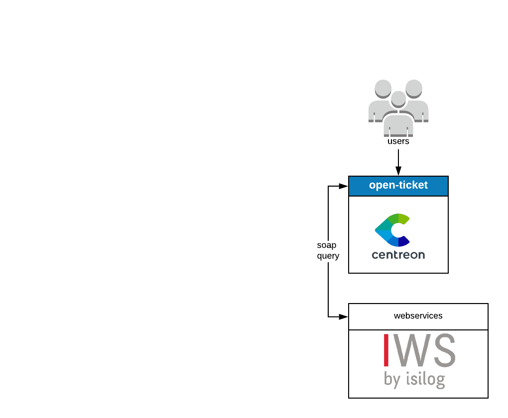
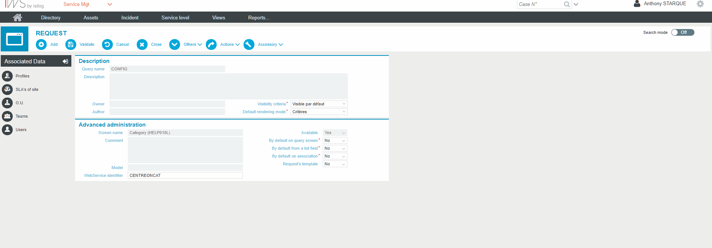
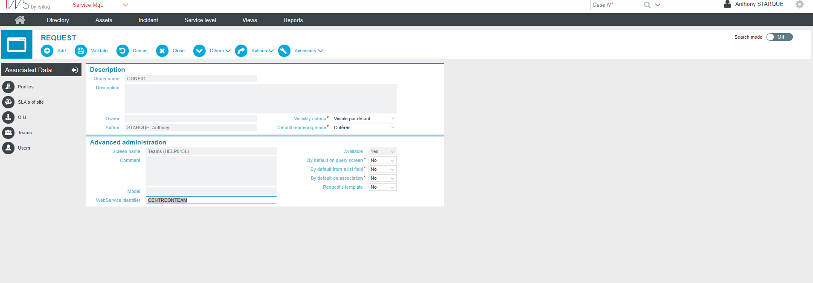
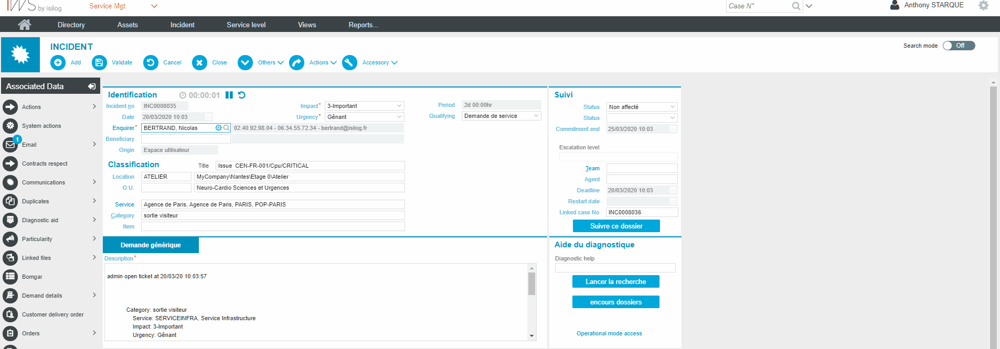
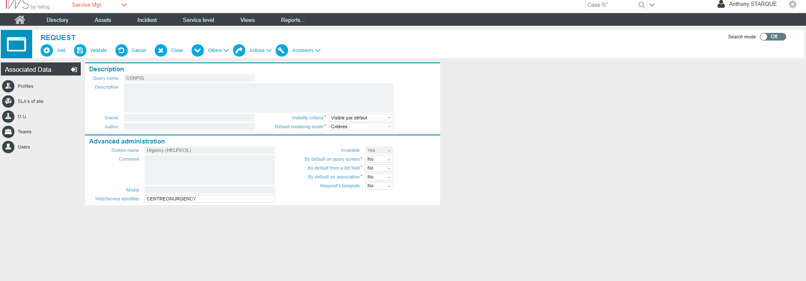
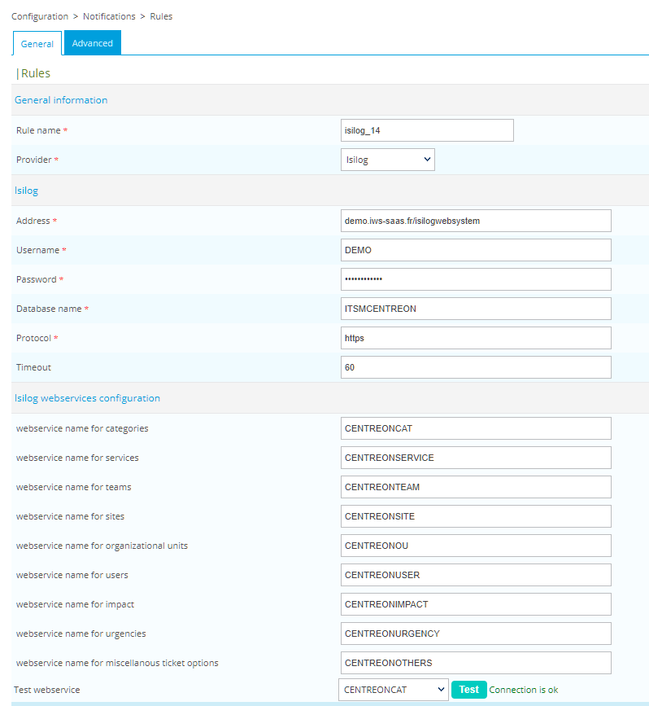

## How it works

Isilog open-tickets provider uses the Isilog SOAP API to open incidents about
your monitoring alerts.

## Compatibility

This integration is (at least) compatible with the following Isilog versions:

**to be determined**

## Requirements

Before going any further, make sure that you correctly setup
[centreon-open-ticket](https://documentation.centreon.com/docs/centreon-open-tickets/en/latest/installation/index.html)
into your Centreon instance

Our provider requires the following parameters:

| Parameter | Example of value                                |
| --------- | ----------------------------------------------- |
| Address   | demo.iws-saas.fr/isilogwebsystem                |
| Username  | DEMO                                            |
| Password  | MyPassword                                      |
| Database Name | MYITSM                                      |
| Protocol  | https                                           |
| Timeout   | 60                                              |

## Possibilities

As of now, the provider is able to retrieve the following objects from Isilog:

  - Categories
  - Services
  - Impacts
  - Urgencies
  - Qualifiers
  - Origins
  - Teams
  - Users
  - Business Units (BU)
  - Sites
  - Customers

## Isilog Configuration

To retrieve all those informations you need to configure Isilog webservices and put their names in the provider configuration.
In this example, we are using the default queries from Isilog. This is not mandatory, you can use an already configured query and
set the webservice name of the query to your wanted value. 

### Categories webservice

### Sites webservice

### Business Units webservice

### Teams webservice

### Users webservice

### Impacts webservice

### Urgencies webservice

### Services webservice

### Others webservice

## Centreon configuration

When your desired webservices are configured, you can just put their name in your provider configuration and test your connection

